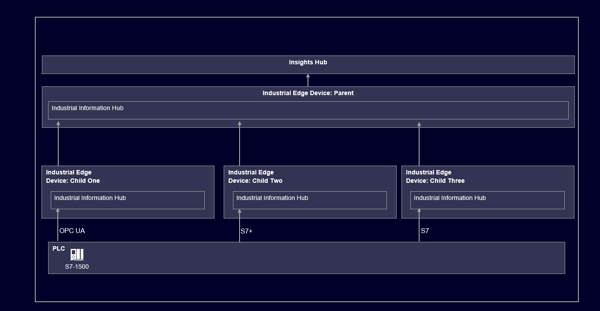
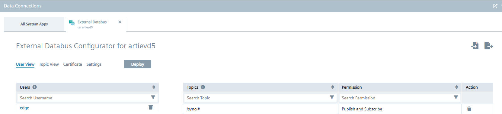
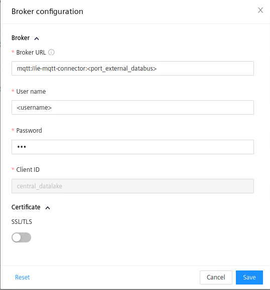
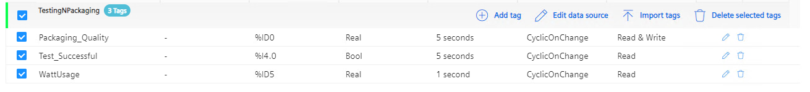
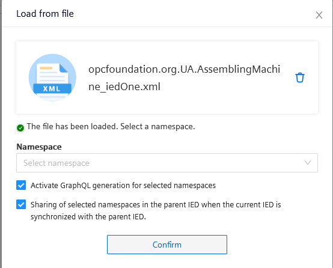
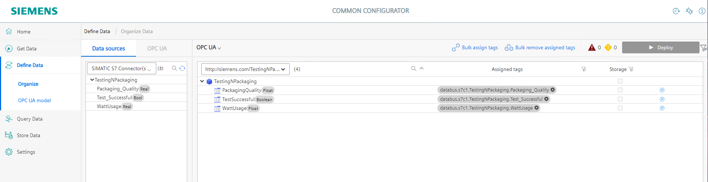
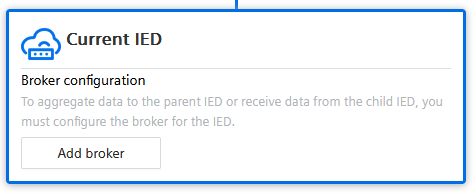
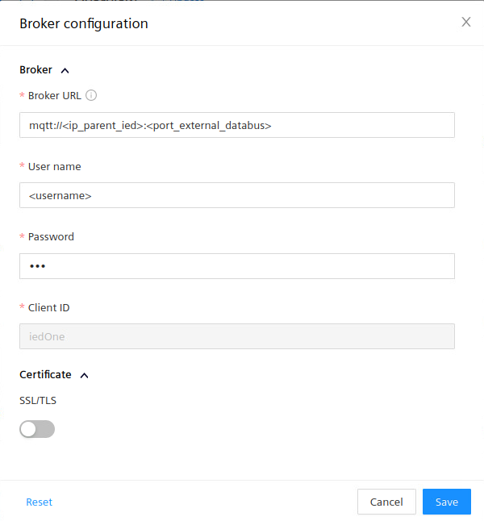
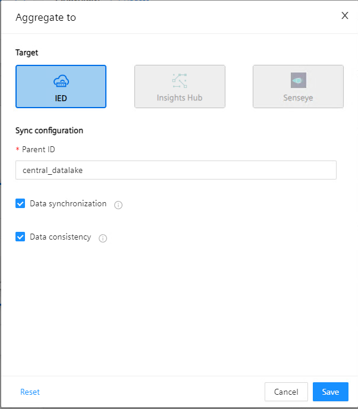

# IIH2IIH Connectivity

- [IIH2IIH Connectivity](#iih2iih-connectivity)
  - [Description](#description)
    - [Overview](#overview)
    - [General Task](#general-task)
  - [Requirements](#requirements)
    - [Prerequisites](#prerequisites)
  - [Installation](#installation)
    - [Setup PLC Simulation](#setup-plc-simulation)
    - [Setup Synchronization](#setup-synchronization)
      - [Setup Parent IED](#setup-parent-ied)
        - [Configure the External Databus application](#configure-the-external-databus-application)
        - [Configure IIH2IIH configuration](#configure-iih2iih-configuration)
      - [Setup Child IEDs](#setup-child-ieds)
        - [Configure Data Aquisition](#configure-data-aquisition)
        - [Configure OPC UA Model for Synchroninzation](#configure-opc-ua-model-for-synchroninzation)
        - [Connect Data with OPC UA Model](#connect-data-with-opc-ua-model)
        - [Configure Synchronization with Parent IED](#configure-synchronization-with-parent-ied)
    - [Final configuration on the Parent-IED](#final-configuration-on-the-parent-ied)
    - [Connect Insights Hub](#connect-insights-hub)


## Description

### Overview

In a large factory with varying machines and data producers it is necessary to acquire the data with various protocols and devices. To uniform the data retrieval, the IIH provides the synchronization feature, where the data is synchronized to one device. This enables simple data access from one single data source.

### General Task

This tutorial describes the steps, that are necessary to create a synchronized connection between three child and one parent device. A possible use-case would be, that the customer wants to analyze factory wide data from one central data-lake. Here, the parent device connects to a cloud solution to diaccomplish such a scenario. Following graphic demonstrates the use case.



## Requirements

### Prerequisites
- Industrial Edge Management System (IEM)
- Four onboarded Industrial Edge Devices (IEDs)
  - IED **in**dependent Installations:
    - Common Configurator
    - Common Import Converter
    - Databus
    - IIH Essentials
    - IIH Semantics
    - Registry Service
  - IED dependent installations:
    - *Child One*
      - Simatic S7 Connector
    - *Child Two*
      - Simatic S7+ Connector
    - *Child Three*
      - OPC UA Connector
    - *Parent*
      - OPC UA Connector
      - External Databus
- TIA Portal v19
- PLCSIM Advanced v5
- Insights Hub Tenant


## Installation

This section provides a guide to setup the desired infrastructure. We start from the button of the architecture overview and work up, till the Cloud-Level.

### Setup PLC Simulation

Please import following project into TIA Portal v19 and deploy it to PLCSIM Advanced v5.
Make sure that PLCSIM Advanced is in the same network as the IEDs.
The project can be found [here](src/tia_portal_project/hm24_iih2iih_simple_production_line.zap19).

The simulation replicates a simple production factory with three different steps. First the produt is assembled by the *Assembling Machine*, then the *Enclosure Assembly* adds an enclosure and finally the product is tested and packaged by the *Testing and Packaging* Machine. All tree machines produce different varrying parameters that can be observed and extracted via OPC-UA, S7+ or S7. 

The idea is to have the three machines connected to one IED each. Each IED gathers the data by a different connector. To avoid subscribing to three different IEDs, the data is synchronized to one central parent device. Following table shows all available parameters.

```
Machine 1 - CircuitBoardAssembly:
- SolderingTemperature [float] -> ~350 °C
- MovementSpeed [float] -> ~3 m/s
- WattUsage [float] -> ~500 Watt
Machine 2 - EnclosureAssembly:
- EnclosurePressure [float] -> ~20 N
- MovementSpeed [float] -> ~5 m/s
- WattUsage [float] -> ~250 Watt
Machine 3 - TestingNPackaging:
- PackagingQuality [float] -> ~95 %
- TestSuccessful [bool] -> True/False
- WattUsage [float] -> ~50 Watt
```

### Setup Synchronization

#### Setup Parent IED

##### Configure the External Databus application

Open the IEM where all IEDs are onboarded and navigate to **Data Connections**. 
Select the External Databus and launch it for the Parent-IED. 

- Enter /sync/# as the "Topic name".
- Enter a username and password of your choice.
- Set the "Permission" to "Publish and subscribe".


Please start with the Parent-IED before continuing with the Child-IEDs.

- Go to the tab **Certificate**
  - If you do not want to use a secure connection, select "Unsecure".
  - If you want to use a secure connection, select "End-to-end security" and upload the corresponding files.e". 
- To deploy the configuration, click "Deploy".

##### Configure IIH2IIH configuration

Open the Common-Configurator on the Parent IED and naviagte to the "Home"-Tab.
Click on Add Broker to add the external databus as the central mqtt-broker that should be used for the synchronization between the child and parent devices. As broker URL use the service-name of the external databus as in the following graphic. Use the port associated to the external databus (default: 9883) and enter the previously configured credentials.



The parent is now set, to receive synchronization requests from the child devices. Now we will setup the child IEDs and establish the first connection. Afterwards we will move back to the Parent-IED.


#### Setup Child IEDs

For each Child-IED repeat the steps below.

##### Configure Data Aquisition

Setup for each device a different connector.

- IED-Child-One
  - OPC UA
- IED-Child-Two
  - S7+
- IED-Child-Three
  - S7

For the OPC UA connection add the data source from the running PLCSIM Advanced project.
Use following IP: opc.tcp://<ip-plcsim-advanced>:4840 and select security to non and authentication to anonymous.
Browse the variables and add following elements. Choose the other options depending on your scenario:

```
- SolderingTemperature [lreal]
- MovementSpeed [lreal]
- WattUsage [lreal]
```

For the S7+ connection add the data source with following [file](cfg-data/childs/s7_plus_data_import.zip).
From the import file select only following variables:

```
- EnclosurePressure [lreal]
- MovementSpeed [lreal]
- WattUsage [lreal]
```


For the S7 connection add the tags and the data-source manually. Choose for the data-sourc Rack: 0, Slot: 1. Use the following graphic as reference, when adding the tags.




##### Configure OPC UA Model for Synchroninzation

Please read the whole passage before configuring.

Open the tap **Define Data** and navigate to OPC UA Model. There you see the option to import a OPC UA Data Model. For each device, depending if it is Child-One, -Two or -Three, use the respective files.

- IED_One -> [**AssemblingMachineType.xml**](cfg-data/childs/AssemblingMachineType.xml) and [**AssemblingMachine.xml**](cfg-data/childs/EnclosureAssembly.xml)
- IED_Two -> [**EnclosureAssemblyType.xml**](cfg-data/childs/EnclosureAssemblyType.xml) and [**EnclosureAssembly.xml**](cfg-data/childs/EnclosureAssembly.xml)
- IED_Three -> [**TestingNPackagingType.xml**](cfg-data/childs/TestPackagingType.xml) and [**TestingNPackaging.xml**](cfg-data/childs/TestPackaging.xml)

Always upload first the "...Type.xml" file, select the corresponding namespace and check all boxes when asked. See following graphic.

When uploading the xml-file, without the *Type*-postfix, then select the corresponding namespace and **un**select all checkboxes.



##### Connect Data with OPC UA Model

After enabling the data aquisition and importing the opc ua models, the connection needs to be mapped on the model. For this navigate to the tab **Define Data** and map the corresponding data source per drag'n drop to the available opc ua model. Use this illustration as reference:



Do this for all three Child-IEDs. Each IED should have a different model.

##### Configure Synchronization with Parent IED

Navigate to the "Home"-Tab and you should see following illustration. Click on Add broker.



With this step the synchronization is established with the parent device. Therefor enter following elements into the configuration:
- <ip_parent_ied>: public ip-address of the parent device
- <port_external_databus>: port on which the external databus of the parent device is exposed (default: 9883)
- <username> & password: credentials that were used to set up the external databus on the parent IED



Save the configuration.

Next to activate the synchronization, stay on the "Home-Tab" and click on the Add-Button 
. Activate the checkboxes and enter the parent-id.




### Final configuration on the Parent-IED

At this point the synchronization should be enabled and the Child-IED should display Connected on the "Home"-Tab of the Common Configurator. Also the Child-IED-IDs should appear now on the Parent-IED "Home"-Tab.

If you switch to the "Define Data"-Tab on the Common Configurator of the Parent-IED, you should find the synchronized OPC UA Models. Test the connection with a OPC UA Client of your choice, and connect to the OPC UA Server of the IIH.

### Connect Insights Hub

With the IIH2IIH feature, only the OPC UA models are synced. To establish a connection with Siemens Insights Hub, the OPC UA Model needs to be mapped to an Asset Model running on the Parent IED. Therefor use the OPC UA Connector inside the Common Configurator to subscribe to the OPC UA Server that is running on the same Parent-IED. Add all variables that are found.

In the next step naviagte to the "Define-Data"-Tab and map the OPC UA Variables to the Asset Model given [here](cfg-data/parent/define_data/model_data.json).

Deploy the model and add a connection to Insights Hub via the Add-Button found in the "Home"-Tab .